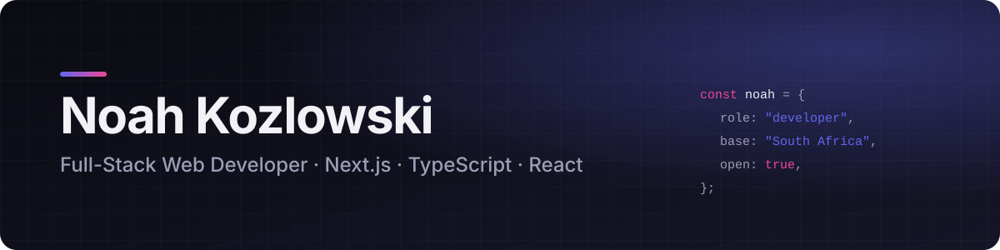

<picture>
  <source media="(prefers-color-scheme: dark)" srcset="assets/banner-dark.svg">
  <source media="(prefers-color-scheme: light)" srcset="assets/banner-light.svg">
  
</picture>

## Hi, I'm Noah 👋

I'm a full-stack web developer based in **South Africa**. I build fast, polished websites
and the tools behind them: lead pipelines, dashboards, scrapers and admin systems.

I started building websites to pay for my first PC, co-founded
[websitethat.rocks](https://websitethat.rocks) with my dad, and now work freelance with
businesses that want a web presence that actually brings in customers.

- 🛠️ **What I do:** custom websites, web apps and business automation, from design to deployment
- 🌱 **Currently learning:** in public in [`web-development`](https://github.com/noahkozlowski-WD/web-development)
- 💼 **Open to:** freelance projects and collaborations. [Get in touch](mailto:dev@noahkozlowski.com)

## Featured work

Most of my client work lives in private repositories. Full case studies with screenshots
are on [my portfolio](https://noahkozlowski.com/#projects).

<table>
  <tr>
    <td width="50%" valign="top">
      <h3>ADvantage</h3>
      SaaS · Ad intelligence
      
Competitor ad research on demand. Pulls every ad a niche is running from Meta's Ad Library, including video, carousels and copy, and uses AI to score creative, copy and offer strength.

      

        
        
        
        
      

    </td>
    <td width="50%" valign="top">
      <h3>BetterLeads</h3>
      Automation · Sales pipeline
      
An end-to-end lead engine for a growth consultancy. It finds local businesses on Google Maps, scores them with AI against an editable rubric, and runs personalised email campaigns with multi-mailbox rotation.

      

        
        
        
        
      

    </td>
  </tr>
  <tr>
    <td width="50%" valign="top">
      <h3>Better Growth Company</h3>
      Brand & marketing sites
      
Five connected sites for a business-growth consultancy, sharing one design system: brand site, lead-magnet page, sales page, offerings and advisory, with forms, referrals and full technical SEO.

      

        
        
        
        
      

    </td>
    <td width="50%" valign="top">
      <h3>Mew Duo Dash</h3>
      Event platform · Full-stack
      
A tournament platform for a community 2v2 Valorant event. Handles player registration, rank-balanced team matching, self-updating brackets and an admin dashboard, all in a game-inspired design.

      

        
        
        
        
      

    </td>
  </tr>
</table>

## Tech stack

**Frontend** 

**Backend & data** 

**Tools & deployment** 

---

Have a project in mind? <a href="mailto:dev@noahkozlowski.com">dev@noahkozlowski.com</a> · <a href="https://noahkozlowski.com">noahkozlowski.com</a>

